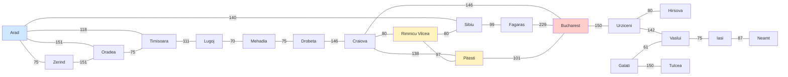

# Punto 1 — Dijkstra a mano: de Arad a Bucarest

Ejecución manual del algoritmo de Dijkstra sobre el grafo de carreteras de
Rumania, buscando el camino más corto de **Arad** a **Bucharest**.

> Este apartado es **solo informe**: no tiene código asociado.

---

## 1. Grafo de Rumania

Los pesos son los **costos reales de cada carretera en kilómetros**, no
distancias en línea recta. Son las aristas del grafo no dirigido que se usa
como ejemplo clásico del algoritmo de Dijkstra.

### 1.1 Diagrama



### 1.2 Aristas y costos (km)

| Carretera | km | Carretera | km | Carretera | km |
|---|---:|---|---:|---|---:|
| Arad – Zerind | 75 | Craiova – Rimnicu Vilcea | 80 | Pitesti – Bucharest | 101 |
| Arad – Oradea | 151 | Craiova – Pitesti | 138 | Bucharest – Urziceni | 150 |
| Arad – Timisoara | 118 | Craiova – Bucharest | 146 | Urziceni – Hirsova | 80 |
| Arad – Sibiu | 140 | Rimnicu Vilcea – Sibiu | 80 | Urziceni – Vaslui | 142 |
| Zerind – Oradea | 151 | Rimnicu Vilcea – Pitesti | 97 | Vaslui – Iasi | 75 |
| Oradea – Timisoara | 75 | Sibiu – Fagaras | 99 | Iasi – Neamt | 87 |
| Timisoara – Lugoj | 111 | Fagaras – Bucharest | 229 | Galati – Vaslui | 61 |
| Lugoj – Mehadia | 70 | Drobeta – Craiova | 146 | Galati – Tulcea | 150 |
| Mehadia – Drobeta | 75 | | | | |

El grafo tiene **20 ciudades y 25 carreteras**. Las 7 ciudades del este
(Urziceni, Hirsova, Vaslui, Iasi, Neamt, Galati, Tulcea) no aportan ningún camino
que acerque a Bucarest: la única forma de llegar al este es pasar por Bucarest
primero, así que la búsqueda nunca necesita relaxarlas y sus etiquetas quedan en
infinito.

---

## 2. Reglas de la ejecución

Se aplican las reglas estándar de Dijkstra:

1. Se inicializa `D(Arad) = 0` y `D(n) = ∞` para todo otro nodo; `P(n) = NIL` para todos.
2. En cada iteración se **extrae de la cola de prioridad el nodo con menor `D`**
   entre los que todavía no son definitivos.
3. Se **relajan los vecinos** del nodo extraído: para cada vecino `v` con costo
   `c(u,v)`, si `D(u) + c(u,v) < D(v)` entonces `D(v) ← D(u) + c(u,v)` y
   `P(v) ← u`.
4. Se repite hasta extraer **Bucharest**. En ese momento su etiqueta ya es
   definitiva y la ejecución termina.

`D` es el **vector de distancias** y `P` el **vector de predecesores**.

---

## 3. Tabla iteración por iteración

En la columna *Relajaciones* se escribe `vecino: D_antes → D_nuevo` para cada
arista que efectivamente mejoró la etiqueta del vecino. Las aristas que se
descartan no se anotan.

| Iter. | Nodo extraído | D | Relajaciones (vecino: antes → nuevo, P) | Cola de prioridad tras la iteración |
|---:|---|---:|---|---|
| 1 | **Arad** | 0 | Zerind: ∞ → 75 (P=Arad)<br>Timisoara: ∞ → 118 (P=Arad)<br>Sibiu: ∞ → 140 (P=Arad)<br>Oradea: ∞ → 151 (P=Arad) | Zerind 75, Timisoara 118, Sibiu 140, Oradea 151 |
| 2 | **Zerind** | 75 | — (Oradea: 75+151=226 > 151) | Timisoara 118, Sibiu 140, Oradea 151 |
| 3 | **Timisoara** | 118 | Lugoj: ∞ → 229 (P=Timisoara) | Sibiu 140, Oradea 151, Lugoj 229 |
| 4 | **Sibiu** | 140 | Rimnicu Vilcea: ∞ → 220 (P=Sibiu)<br>Fagaras: ∞ → 239 (P=Sibiu) | Oradea 151, R.Vilcea 220, Lugoj 229, Fagaras 239 |
| 5 | **Oradea** | 151 | — (Timisoara: 151+75=226 > 118) | R.Vilcea 220, Lugoj 229, Fagaras 239 |
| 6 | **Rimnicu Vilcea** | 220 | Craiova: ∞ → 300 (P=R.Vilcea)<br>Pitesti: ∞ → 317 (P=R.Vilcea) | Lugoj 229, Fagaras 239, Craiova 300, Pitesti 317 |
| 7 | **Lugoj** | 229 | Mehadia: ∞ → 299 (P=Lugoj) | Fagaras 239, Mehadia 299, Craiova 300, Pitesti 317 |
| 8 | **Fagaras** | 239 | Bucharest: ∞ → **468** (P=Fagaras) | Mehadia 299, Craiova 300, Pitesti 317, Bucharest 468 |
| 9 | **Mehadia** | 299 | Drobeta: ∞ → 374 (P=Mehadia) | Craiova 300, Pitesti 317, Drobeta 374, Bucharest 468 |
| 10 | **Craiova** | 300 | Bucharest: 468 → **446** (P=Craiova) | Pitesti 317, Drobeta 374, Bucharest 446 |
| 11 | **Pitesti** | 317 | Bucharest: 446 → **418** (P=Pitesti) | Drobeta 374, Bucharest **418** |
| 12 | **Drobeta** | 374 | — (Craiova y Mehadia ya tienen etiqueta menor) | Bucharest 418 |
| 13 | **Bucharest** | **418** | — | **fin: se extrajo el destino** |

**13 iteraciones.** Bucarest fue extraído en la iteración 13 con `D = 418`.

---

## 4. Vectores finales

### 4.1 Vector de distancias `D`

| Nodo | D (km) | Nodo | D (km) |
|---|---:|---|---:|
| Arad | 0 | Craiova | 300 |
| Zerind | 75 | Mehadia | 299 |
| Timisoara | 118 | Pitesti | 317 |
| Sibiu | 140 | Drobeta | 374 |
| Oradea | 151 | **Bucharest** | **418** |
| Rimnicu Vilcea | 220 | Urziceni, Hirsova, Vaslui, | |
| Lugoj | 229 | Iasi, Neamt, Galati, Tulcea | ∞ |
| Fagaras | 239 | | |

### 4.2 Vector de predecesores `P`

| Nodo | P | Nodo | P |
|---|---|---|---|
| Arad | NIL | Fagaras | Sibiu |
| Zerind | Arad | Craiova | Rimnicu Vilcea |
| Timisoara | Arad | Mehadia | Lugoj |
| Sibiu | Arad | Drobeta | Mehadia |
| Oradea | Arad | Pitesti | Rimnicu Vilcea |
| Rimnicu Vilcea | Sibiu | **Bucharest** | **Pitesti** |
| Lugoj | Timisoara | ciudades del este | NIL |

---

## 5. Reconstrucción de la ruta

Se parte de Bucarest y se siguen los predecesores hacia atrás hasta llegar al
origen, que es el único nodo con `P = NIL`:

```
Bucharest --P--> Pitesti --P--> Rimnicu Vilcea --P--> Sibiu --P--> Arad --P--> NIL
```

Invirtiendo la cadena:

```
Arad -> Sibiu -> Rimnicu Vilcea -> Pitesti -> Bucharest
```

### 5.1 Costo total

| Tramo | km | Acumulado |
|---|---:|---:|
| Arad → Sibiu | 140 | 140 |
| Sibiu → Rimnicu Vilcea | 80 | 220 |
| Rimnicu Vilcea → Pitesti | 97 | 317 |
| Pitesti → Bucharest | 101 | **418** |

El costo total coincide con `D(Bucharest) = 418`. Esa coincidencia es la
comprobación de que los vectores y la reconstrucción son consistentes entre sí.

---

## 6. Verificación contra la alternativa por Fagaras

El camino por Fagaras es el competidor más obvio, porque Fagaras está conectada
directamente con Bucarest:

| Ruta | Desglose | Total |
|---|---|---:|
| Arad → Sibiu → **Fagaras** → Bucharest | 140 + 99 + 229 | **468** |
| Arad → Sibiu → **Rimnicu Vilcea** → Pitesti → Bucharest | 140 + 80 + 97 + 101 | **418** |

**468 km > 418 km**, así que la ruta por Fagaras es 50 km más larga y queda
descartada.

La diferencia está en el tramo final. La conexión directa Fagaras–Bucharest
cuesta 229 km, mientras que bajar por Rimnicu Vilcea y Pitesti cuesta
80 + 97 + 101 = 278 km: se pagan 49 km más en el tramo final, pero se ahorran
los 99 km del salto Sibiu → Fagaras. Balance neto: 50 km a favor de Rimnicu
Vilcea.

Esta comparación muestra por qué el algoritmo **no puede detenerse en el primer
camino que encuentra**. En la iteración 8 la ruta por Fagaras parecía la buena
(`D(Bucharest) = 468`); en la iteración 10 Craiova la mejoró a 446, y en la
iteración 11 Pitesti la dejó en 418. Dijkstra no se queda con la primera
solución parcial: sigue extrayendo y relajando hasta que la etiqueta del destino
es definitiva.

---

## 7. Nota: costos reales, no distancias en línea recta

Dijkstra trabaja con los **costos de las aristas**, que son las longitudes
reales de las carreteras. No puede usar la distancia en línea recta entre dos
ciudades, porque esa distancia **subestima** el costo: entre dos puntos hay
terreno, curvas, poblaciones y límites que obligan a rodear.

| Ciudad | En línea recta a Bucarest | Costo real óptimo | Subestimación |
|---|---:|---:|---:|
| Pitesti | 95 | 101 | −6 |
| Craiova | 142 | 146 | −4 |
| Rimnicu Vilcea | 144 | 198 | −54 |
| Arad | 366 | 418 | −52 |
| Sibiu | 187 | 278 | −91 |
| Oradea | 320 | 569 | −249 |
| Timisoara | 330 | 536 | −206 |

En todos los casos la distancia en línea recta es menor o igual que el costo
real, como debe ser: es una cota inferior. Dos ejemplos concretos de por qué
usarla como peso daría una respuesta equivocada:

- **Arad**: está a 366 km en línea recta, pero ninguna carretera lleva
  directamente a Bucarest, así que el mejor camino real cuesta 418 km. Si se
  usara la distancia recta como peso, Arad "parecería" 52 km más cerca de lo que
  realmente está.
- **Sibiu**: está a solo 187 km en línea recta, y sin embargo ninguna de sus
  carreteras va directa a Bucarest. La única salida que acerca es hacia Fagaras
  y cuesta 99 + 229 = 328 km, mientras que el camino óptimo se va por Rimnicu
  Vilcea y cuesta 278 km. La distancia en línea recta no dice nada sobre cuál de
  las dos carreteras conviene, y además ni siquiera distingue a Sibiu de
  Rimnicu Vilcea, que está bastante más cerca en línea recta pero tiene un
  camino peor.

Por eso el grafo de la sección 1.1 usa kilómetros de carretera como pesos, y esa
es exactamente la razón por la que en el punto 2 del taller la función de peso
de un enlace combina latencia, probabilidad de caída y throughput: son el
análogo de ese "costo real" en una red de conmutación, y por eso los enlaces de
borde pesan más que los de núcleo aunque la distancia sea la misma.

---

## 8. Relación con el código del punto 2

La ejecución manual de arriba es exactamente lo que hace la clase `Dijkstra` del
punto 2, con la diferencia de que allí los pesos no son kilómetros fijos sino
los que devuelve `CalculadoraPeso.calcular(Enlace)`:

| Concepto del punto 1 | En el código |
|---|---|
| Ciudad | `Nodo` |
| Carretera | `Enlace` |
| Costo en km | `Enlace.peso()` (latencia, caída, throughput, zona) |
| Vector de distancias `D` | `Dijkstra.Resultado.dist` |
| Vector de predecesores `P` | `Dijkstra.Resultado.pred` |
| Extracción del mínimo | `PriorityQueue<Entrada>` en `Dijkstra.ejecutar` |
| Reconstrucción de la ruta | `Dijkstra.Resultado.rutaHasta(destino)` |

La diferencia conceptual importante es que **en el simulador los pesos cambian
durante la ejecución**: un `Evento` sube la congestión o tumba un enlace, y por
eso `Dijkstra` se vuelve a correr para cada paquete, con los vectores `D` y `P`
recalculados desde cero. En el punto 1, en cambio, los pesos son fijos y por eso
bastaba una sola ejecución.
